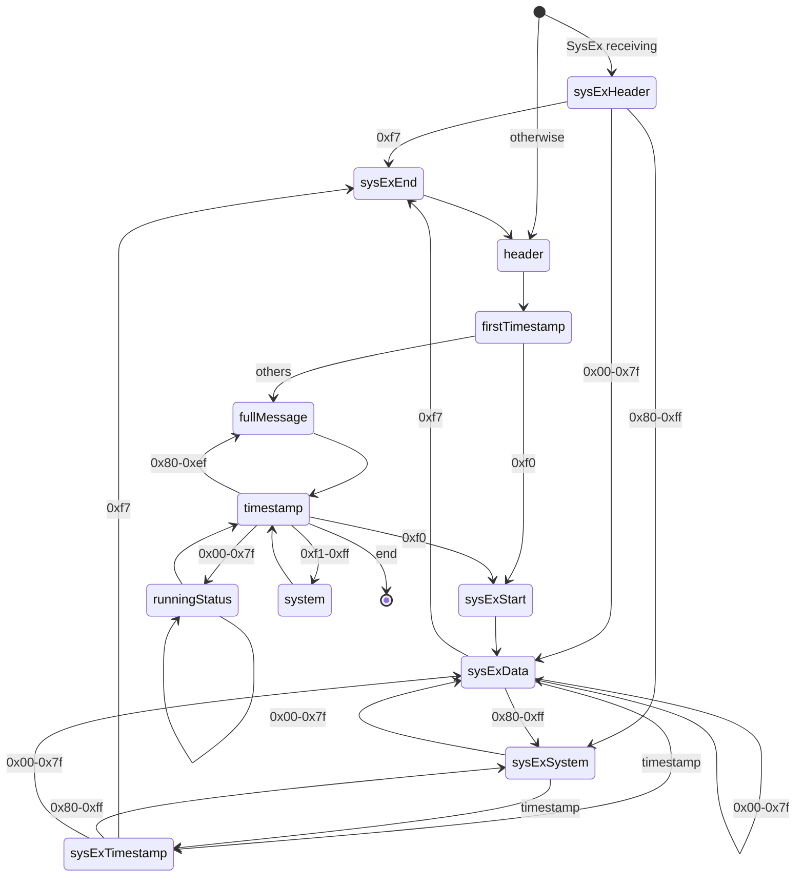

[](https://badge.fury.io/js/web-ble-midi) [](https://github.com/ryohey/web-ble-midi/actions) [](https://opensource.org/licenses/MIT)

# web-ble-midi

A library for easily handling BLE MIDI input in the browser using Web Bluetooth API.

## Installation

```bash
npm install web-ble-midi --save
```

## Usage

```ts
import { BLEMIDI } from "web-ble-midi"

// Check if Web Bluetooth is supported
if (!BLEMIDI.isSupported()) {
  console.error("Web Bluetooth is not supported in this browser")
}

// Scan for a device
async function scanAndConnect() {
  try {
    // Will prompt the user to select a device with a browser dialog
    const device = await BLEMIDI.scan({
      namePrefix: "BLE-MIDI", // Optional: filter by name prefix
    })

    console.log("Selected device:", device.name)

    // Register event listeners
    device.addEventListener("midimessage", (event) => {
      // MIDIMessageEvent has a message property with the MIDI data
      const message = event.message
      console.log("Received MIDI message:", message)

      // Access the raw MIDI data
      const statusByte = message.message[0]
      const channel = statusByte & 0x0f

      // Handle note-on messages
      if ((statusByte & 0xf0) === 0x90 && message.message[2] > 0) {
        const noteNumber = message.message[1]
        const velocity = message.message[2]
        console.log(
          `Note On - Channel: ${
            channel + 1
          }, Note: ${noteNumber}, Velocity: ${velocity}`
        )
      }
    })

    device.addEventListener("disconnect", () => {
      console.log("Device disconnected")
    })

    // Connect to the device
    await device.connect()
    console.log("Connected to device:", device.name)

    // Later, when you want to disconnect:
    // device.disconnect();
  } catch (error) {
    if (error.name === "NotFoundError") {
      console.log("User cancelled the device selection")
    } else {
      console.error("Connection error:", error)
    }
  }
}

// Trigger scanning when a button is clicked
document
  .getElementById("connectButton")
  .addEventListener("click", scanAndConnect)
```

## Parser State Machine

The MIDI parser in this library operates according to the following state machine:


