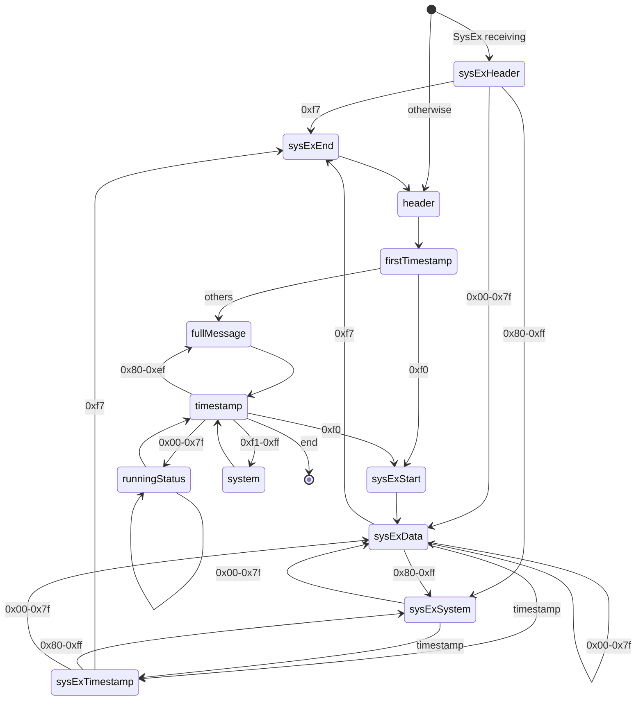

[](https://badge.fury.io/js/web-ble-midi) [](https://github.com/ryohey/web-ble-midi/actions) [](https://opensource.org/licenses/MIT)

# web-ble-midi

A library for easily handling BLE MIDI input in the browser.

## Installation

```bash
npm install web-ble-midi --save
```

## Usage

```ts
import { read } from "web-ble-midi"
```

## Parser State Machine

The MIDI parser in this library operates according to the following state machine:


